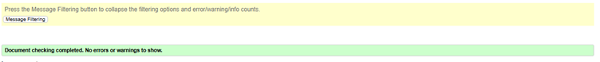
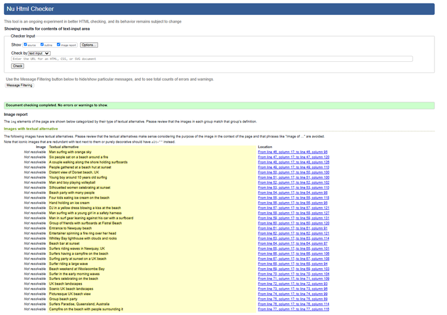
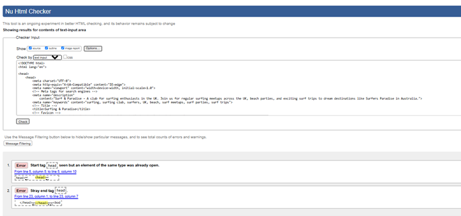
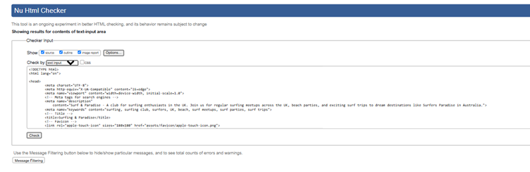
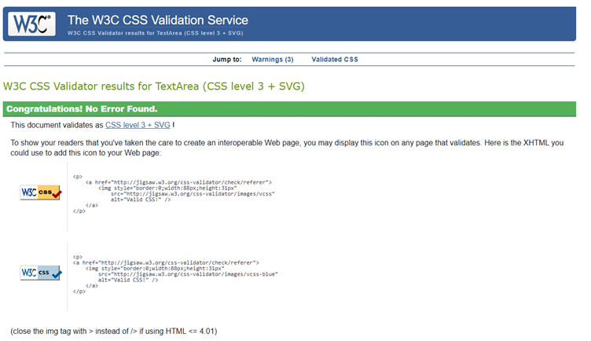

# **Surfing & Paradise** 
Website URL: https://github.com/AllaboutDee/P1

## **Site Overview**
Welcome to Surfing & Paradise – the site that connects surfing enthusiasts whether you are a beginner, intermediate or advanced. Here at Surfing & Paradise we foster a community that want to learn new skills, interact with others and make new friendships, where people enjoy exploring and travelling together and love to enjoy the beach culture. Surfing & Paradise host regular events after surfing such as picnics, beach parties, campfires and much more so there is always time to relax and unwind after a long surfing session. The club is family friendly and encourages members to bring their kids along and get them started early so that this is a sport the whole family can enjoy together.
The website aims to serve as an engaging and user-friendly guide for Surf lovers. The layout is built with a responsive, mobile-first approach, with sections that cater to different content areas, ensuring ease of navigation and appealing visual design.

## Table of contents:
1. [**Site Overview**](#site-overview)
1. [**Planning stage**](#planning-stage)
    * [***Target Audiences***](#target-audiences)
    * [***User Stories***](#user-stories)
    * [***Site Aims***](#site-aims)
    * [***How Is This Will Be Achieved:***](#how-this-will-be-achieved)
    * [***Wireframes***](#wireframes)
    * [***Color Scheme***](#color-scheme)
    * [***Technology Used***](#Technology-Used)
    * [***Languages Used***](#Languages-Used)
    * [***Frameworks, Libraries & Programs Used***](#Frameworks,-Libraries-&-Programs-Used)
1. [**Current Features Common to all pages**](#current-features-common-to-all-pages)
    * [***Header Element:***](#header-element)
        * [*Title*](#title)
        * [*Logos*](#logos)
        * [*Navigation Bar*](#navigation-bar)
        * [*Design*](#Design)    
    * [**Footer**](#footer)
1. [**Future-Enhancements**](#future-enhancements)
1. [**Testing Phase**](#testing-phase)
        * [*Testing*](#Testing)
        * [*Testing User Stories from User Experience (UX) Section*](#Testing-User-Stories-from-User-Experience-(UX)-Section)        
        * [*Further Testing*](#Further-Testing)
1. [**Accessibility**](#Accessibility)
1. [**Known Bugs**](#Known-Bugs)
1. [**Deployment**](#deployment)
1. [**Credits**](#credits)
    * [**Honourable mentions**](#honorable-mentions)
    * [**General reference**](#general-reference)
    * [**Content**](#content)
    * [**Media**](#media)

    ## **Planning stage**
    In the planning stage, key elements were defined to shape the website’s structure, including user experience (UX) principles, aesthetic style, and interactive features. Each section was designed to enhance engagement and usability, focusing on both desktop and mobile views.
### **Target Audiences:**

* The primary audience includes individuals interested in the activity or club promoted by the site, in this case Surfing.
* Families who want to have an activity they can do all do together.
* People who want to meet other like-minded individuals, who want to learn, explore, travel and have fun.
* People who love travelling in groups and like the idea of creating a close-knit community.
* People who are not afraid of water, the outdoors and the British weather, or those who would like to overcome these fears
* Prospective new members or supporters who may want to learn more, participate, or get involved in future events and activities.

### **User Stories:**
* As a user, I want to see upcoming events.
* As a user, I want to be able to search for events based on certain search criteria e.g. location, date, activity type.
* As a user, I want to navigate through the site with ease.
* As a user, I want to know my information is secure to enable me to interact with others confidently.
* As a user, I want the ability to find businesses local to me which offer the product or service for my needs.

### **Site Aims:**
* To create a safe and welcoming, dedicated space for the African and Caribbean community.
* To provide activities to promote social interactions, cultural connections, relationship building, business awareness and a sense of community.
* Represent the African and Caribbean community
* Enable users to interact with the site through their profile, hosting activities and promoting their business.

### **User Stories:**

* As a user, I want to navigate easily across the site to find relevant information.
* As a user I want to see upcoming events easily.
* As a user I want to easily see what the website is about.
* As a user I want to see an aesthetically pleasing website.
* As a user I want to know my information is safe and secure so that I can interact with others confidently.
* As a user, I want the site to be accessible and look visually appealing on my mobile, ipad and laptop device.
* As a user and a prospective member, I want a clear sign-up form to join.
* As a user and current member, I want up-to-date information on upcoming events and meetups.

### **Site Aims:**

* Informative: Provide users with easy access to activity or club details, schedules, and information about the club.
* Engaging: Use visual elements and a clear layout to attract and retain visitor attention.
* Community-focused: Promote connection among users through events, gallery images, and sign-up options.

### **How Will This Be Achieved:**

Each aim is reflected in the design choices, such as the use of high-quality images, event schedules, a gallery page, and a signup form. The site also has a clean layout, fast loading times, and accessibility considerations, ensuring a smooth experience.

* The Home page will have a white background contrasted with splashes of beautiful vibrant colours and images related surf and sea. The header and buttons will be a blue/green colour, and any cover text may be reds or oranges to play of other colours within the images used so help it all tie in nicely.
* The Home page will have  clear sections such as the header, main image, welcome section with a clickable button which take you to the sign-up page, a why join section, Upcoming schedule section, footer will have links to the social media pages.
* The Gallery section will have lots of vibrant pictures of members surfing, relaxing, partying, playing other sport and amazing surf spots visited to showcase that it is a club but a close- knit community that like to learn, travel and have fun. 
* The sign-up page has 1 image of members and an easy to complete sign up form which options to ask a question, inquire about memberships, sign up to the newsletter or leave a comment. 

### **Wireframes:**
I used****** to make a visual representation of the surfing website. Below are the initial design ideas:
    * ![Homepage] ()
    * ![Gallery] ()
    * ![Signup] ()
    COME BACK TO THIS SECTON

### **Color Scheme:**

I wanted the colour scheme to vibrant with the main colour being a mix of blue and green to reflect the sea and waves with splashes of reds, oranges and yellows reflective of the dark sunset sky. I wanted the bright header and pictures to be contrasted against a white background so that the colours really stand out. For the  background colour of the header I chose #bdf2f6. I did this by uploading the hero image first and then playing with the colour palette to find a colour that matches well without being too clashy. 
The container for the cover-text had to be a contrast colour to show against the hero image. I went for an orange/coral shade to complement the skin tones and red/orange colour shorts of the surfers aswell as the sunset sky in the image further down the page.  . The little splashes of colours really makes the page stand out even more. 

### **Technology Used:**
## Languages Used

-   [HTML5](https://en.wikipedia.org/wiki/HTML5)
-   [CSS3](https://en.wikipedia.org/wiki/Cascading_Style_Sheets)
 -  [CSS Flexbox and Grid]??

### Frameworks, Libraries & Programs Used

1. [Font Awesome:](https://fontawesome.com/)
    - Font Awesome was used on the forms on the activity page, alongside the social media icons within the footer.
1. [Git:](https://git-scm.com/)
    - Git was used for version control by utilizing the command line terminal to commit to Git and Push to GitHub.
1. [GitHub:](https://github.com/)
    - GitHub was used to store the project code after being pushed from Git.
1.  [VisualStudioCode:] (https://code.visualstudio.com/)
1.  Visual Studio Code was used to write the project code and then pushed through to the Git Repository.
1. [Favicon.io:] (https://favicon.io/)
    - Favicon.io was used to create a favicon to display in the browser. Image of a man holding a surfboard was downloaded from pixabay. This was this uploaded to favicon.io to convert the image and create the favicon item. 
1. [Hover.css:](https://ianlunn.github.io/Hover/)
    - Hover.css was used on the navigation links
1. [Pixabay:] (https://pixabay.com/)
    - Pixabay was used source royalty-free images for the website.
1. [Pexels:](https://www.pexels.com/)
    - Pexels was used to source royalty-free images for the website.
1. [Balsamiq:]?????

## **Current Features Common to all pages**
### **Main body**
The site has a consistent layout across all pages, with shared header and footer elements for easy navigation and a unified look.

### *Header Element:*
The header is used throughout the site to hold the navigation bar and the site title.

* Title: A clear, stylized title displayed prominently for easy recognition.
* Logos: Designed in the 'Great Vibes' font, the logo sits centrally within the header. The font cursive font used compliments sea and waves. The dark colour fonts stands out nicely against the background colour of the header.
* Navigation Bar: A responsive, mobile-first navigation menu that adjusts based on screen size.
* Background colour: A vibrant blue/green colour to compliment the images of the sea. 

![Header] (assets/images/header.png)

### *Footer:*
The footer includes social media links for Facebook, X-app, YouTube and Instagram.  I have gone for a dark grey background with the social media icons in white for a nice contrast.  This is style to contrast against the white background of the body. 

![Footer:] (assets/images/footer.png)

## **Future-Enhancements**

* Expanded Event Calendar: Add more interactive elements to showcase upcoming events.
* Blog/News Section: Incorporate a blog for activity-related articles and updates.
* E-commerce Feature: Option for users to purchase branded merchandise directly from the site.
* More Informative: Add more information to website regarding membership fees, surf classes, instructor information, discounts and resources.

### **Testing Phase**

## **Testing**

The W3C Markup Validator and W3C CSS Validator Services were used to validate every page of the project to ensure there were no syntax errors in the project.

-   [W3C Markup Validator](https://validator.w3.org/nu/) 
    
    Homepage:

    Initial tests shows were no error to be corrected.
    
    After fixing the errors, the final test results confirm no errors or warnings.
    

    Gallery Page:

    Initial tests show various errors to be corrected.
    
    After fixing the errors, the final test results confirm no errors or warnings.
    

    Signup Page:

    Initial tests show various errors to be corrected.
    
    After fixing the errors, the final test results confirm no errors or warnings.
    

-   [W3C CSS Validator](https://jigsaw.w3.org/css-validator) 

    CSS:

    Initial tests shows there are no errors be corrected.
    
    
### Testing User Stories from User Experience (UX) Section

1. As a user, I want to navigate easily across the site to find relevant information.
    1. The navigation bar is simple and easy to use. In mobile view this becomes a burger bar with a drop down option.
2. As a user I want to see upcoming events easily.
    1. The upcoming events are clearly listed on the home page, with the location and date.
3. As a user I want to easily see what the website is about.
    1. The website is clear and logical. Information is in relevant sections and in small chunks and it is not over-crowded. 
4. As a user I want to see an aesthetically pleasing website.
    1. The website is layed out nicely into sections with stunning pictures and a vibrant colour palette is used throughout.
5. As a user I want to know my information is safe and secure so that I can interact with others confidently.
    1. Users can complete the signup form safely and securely, which allows them submit basic informatio such as their name and email address and their questions or reason for contact. 
    2. Currently the basic details are entered and someone will respond off teh back of the query. Currently the website does not ask more personal information then that but as the website grows it will lst more information and allows customers to sign up on line and buy merchandise at which more more safety features would be added. 
    3. At this stage of the build, the functionality for chat, sign-in and profile pages has not been implemented. 
6. As a user, I want the site to be accessible and look visually appealing on my mobile, ipad and laptop device.
    1. The website design is responsive  from mobile to ipad to laptop in most cases. There is an issue with the logo and menu overlap on Samsung S8+ and Galaxy Z fold 5. Also there is an issue with header and cover-text overlap on ipad Mini. Due to time constraints this issue has not yet been correct.  
7. As a user and a prospective member, I want a clear sign-up form to join
    1. The signup form has a very simple layout. It is easy to understand and use. It offers the option of signing up to the newsletter, leaving a comment or asking a question. You can enter your level of surfing expertise aswell. 

### Further Testing

-   The Website was tested on Google Chrome, Internet Explorer and Microsoft Edge.
-   The website was viewed on a variety of devices such as Desktop, Laptop and android phones.
-   Testing was done to ensure that all pages were linking correctly without time delays.
-   Friends and family members were asked to review the site and documentation to point out any bugs and/or user experience issues.

### Accessibility
I wanted to ensure the site supported all visitors, I included the following in my code to ensure this:

* All images contained an alt tag
* All images were saved as webp or jpg, for a reduced file size to support the load time of images
* The site is responsive to different screen sizes 
* Semantic elements were used throughout the design

### ***Known Bugs***

* The logo and burger menu overlap slightly in mobile view for the Galaxy S8+ and Galaxy Z Fold 5. I was unable to rectify this without causing further distotion to the web page, i there fore reversed the changes and will work on fixing these errors properly. 
* The container with the cover image on the home page is partly hidden behind the header on ipad Mini view. I was unable to remediate this without causing further distortion to the webpage. I will look to fix this error in due course.

## **Deployment**
I deployed the page on GitHub pages via the following procedure: -

1. From the project's [repository](https://github.com/AllaboutDee/P1), go to the **Settings** tab.
2. From the left-hand menu, select the **Pages** tab.
3. Under the **Source** section, select the **Main** branch from the drop-down menu and click **Save**.
4. A message will be displayed to indicate a successful deployment to GitHub pages and provide the live link.

***
## **Credits**
### **Honourable mentions**

 I would like to thanks a few of my fellow bootcampers for their support in resolving issues that I stumbled upon, listed in no particular order:

* [Jasmine Price](https://github.com/jevpr) - My fellow bootcamper who has happy to take some time out and look at my code when I was really stuck. he helped me to resolve some pressing issues for which I am extremely grateful. 

*[Asraf] (https://github.com/PATH-HIVE) - My fellow bootcamper who helped me with various Github issues and continually urged me to complete my project despite the many obstacles I faced. 

### **General reference:**

* I relied upon what I learned from code institute, youtube, W3schools and stack overflow for general "how to's" throughout the project. I based my original structure and layout for my website on the Love Running project on Code Institute but enhanced it further with additional functionalities.   

*

### **Content:**
* Most of the content was written by myself.
* Icons in the forms were taken from [Font Awesome](https://fontawesome.com) 

### **Media:**
* Images used for activities were taken from [Pexels](https://www.pexels.com/) and [Pixabay] (https://www.pixabay.com) 
    

