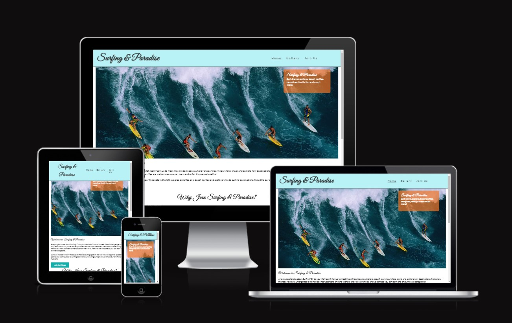

# **Surfing & Paradise** 
Website URL: https://github.com/AllaboutDee/P1

## **Site Overview**
Welcome to **Surfing & Paradise** – a community-driven site that connects surfing enthusiasts of all levels. Whether you're a beginner, intermediate, or advanced, Surfing & Paradise offers resources and events for skill-building, community engagement, and fun experiences. Our club fosters a supportive environment where members can explore and travel together, enjoy beach culture, and make lasting friendships. 

Surfing & Paradise hosts regular events, such as beach parties, picnics, and campfires, so members can relax and unwind after a surfing session. Families are welcome, as we encourage members to bring their kids along to share this family-friendly sport. This website aims to serve as an engaging, user-friendly guide for surf lovers. Built with a responsive, mobile-first approach, its layout caters to various content areas, ensuring ease of navigation and visual appeal.

## Table of contents:
1. [**Site Overview**](#site-overview)
1. [**Planning stage**](#planning-stage)
    * [***Target Audiences***](#target-audiences)
    * [***User Stories***](#user-stories)
    * [***Site Aims***](#site-aims)
    * [***How Is This Will Be Achieved:***](#how-this-will-be-achieved)
    * [***Wireframes***](#wireframes)
    * [***Color Scheme***](#color-scheme)
    * [***Technology Used***](#Technology-Used)
    * [***Languages Used***](#Languages-Used)
    * [***Frameworks, Libraries & Programs Used***](#Frameworks,-Libraries-&-Programs-Used)
1. [**Current Features Common to all pages**](#current-features-common-to-all-pages)
    * [***Header Element:***](#header-element)
        * [*Title*](#title)
        * [*Logos*](#logos)
        * [*Navigation Bar*](#navigation-bar)
        * [*Design*](#Design)    
    * [**Footer**](#footer)
1. [**Future-Enhancements**](#future-enhancements)
1. [**Testing Phase**](#testing-phase)
        * [*Testing*](#Testing)
        * [*Testing User Stories from User Experience (UX) Section*](#Testing-User-Stories-from-User-Experience-(UX)-Section)        
        * [*Further Testing*](#Further-Testing)
1. [**Accessibility**](#Accessibility)
1. [**Known Bugs**](#Known-Bugs)
1. [**Deployment**](#deployment)
1. [**Credits**](#credits)
    * [**Honourable mentions**](#honorable-mentions)
    * [**General reference**](#general-reference)
    * [**Content**](#content)
    * [**Media**](#media)

    ## **Planning stage**
    In the planning stage, key elements were defined to shape the website’s structure, including user experience (UX) principles, aesthetic style, and interactive features. Each section was designed to enhance engagement and usability, focusing on both desktop and mobile views.
### **Target Audiences:**
* Surfing enthusiasts of all levels
* Families seeking activities to enjoy together
* Individuals wanting to meet like-minded adventurers
* Community-oriented travelers and beach culture fans
* People eager to explore, learn, and connect within a supportive group
* Prospective new members who want to learn, participate, or get involved in future events and activities

### **User Stories:**
* As a user, I want to see upcoming events.
* As a user, I want to be able to search for events based on certain search criteria e.g. location, date, activity type.
* As a user, I want to navigate through the site with ease.
* As a user, I want to know my information is secure to enable me to interact with others confidently.
* As a user, I want the ability to find businesses local to me which offer the product or service for my needs.

### **Site Aims:**
* To create a safe and welcoming, dedicated space for the African and Caribbean community.
* To provide activities to promote social interactions, cultural connections, relationship building, business awareness and a sense of community.
* Represent the African and Caribbean community
* Enable users to interact with the site through their profile, hosting activities and promoting their business.

### **User Stories:**

* As a user, I want to navigate easily across the site to find relevant information.
* As a user I want to see upcoming events easily.
* As a user I want to easily see what the website is about.
* As a user I want to see an aesthetically pleasing website.
* As a user I want to know my information is safe and secure so that I can interact with others confidently.
* As a user, I want the site to be accessible and look visually appealing on my mobile, ipad and laptop device.
* As a user and a prospective member, I want a clear sign-up form to join.
* As a user and current member, I want up-to-date information on upcoming events and meetups.

### **Site Aims:**

* Informative: Provide users with easy access to activity or club details, schedules, and information about the club.
* Engaging: Use visual elements and a clear layout to attract and retain visitor attention.
* Community-focused: Promote connection among users through events, gallery images, and sign-up options.

### **How Will This Be Achieved:**

Each aim is reflected in the design choices, such as the use of high-quality images, event schedules, a gallery page, and a signup form. The site also has a clean layout, fast loading times, and accessibility considerations, ensuring a smooth experience.

* The **Home page** has a white background with vibrant colors and images reflecting surf and sea. The header and buttons are in blue/green tones, while reds and oranges in the cover text complement the visuals, tying it all together.
* The **Gallery section** showcases vibrant pictures of members surfing, relaxing, and partying, reinforcing the club’s close-knit, community vibe.
* The **Sign-up page** features a simple form for inquiries, membership sign-ups, and newsletter subscriptions.

### **Wireframes:**

*Add wireframe visuals here:*
Initially I drew a very basic draft of what the webpages may look like on mobile view. 

[Homepage/Gallery/Signup] (assets/images/screenshots/draft_mobile_view.JPG)

Once the website was complete Am I Responsive tool was used display the website on different screen sizes. Below are the initial design ideas:
    * ![Homepage] (assets/images/screenshots/Am_I_Responsive.jpg) (assets/images/screenshots/Am_I_Responsive2.jpg)(assets/images/screenshots/Am_I_Responsive3.jpg)
    * ![Gallery] (assets/images/screenshots/Am_I_Responsive_Gallery.jpg)
    * ![Signup] (assets/images/screenshots/Am_I_Responsive_signup.jpg)

### **Color Scheme:**

I selected a vibrant color scheme inspired by the sea, with blues and greens as primary colors and touches of red, orange, and yellow reflecting a sunset sky. A white background makes these colors stand out, while the header’s `#bdf2f6` color complements the hero image. The cover text container features an orange/coral tone to contrast the hero image and tie into the theme cohesively.

## **Technology Used:**
### Languages Used

-   [HTML5](https://en.wikipedia.org/wiki/HTML5)
-   [CSS3](https://en.wikipedia.org/wiki/Cascading_Style_Sheets)

### Frameworks, Libraries & Programs Used

1. [Font Awesome:](https://fontawesome.com/)
    - Font Awesome was used on the forms on the activity page, alongside the social media icons within the footer.
1. [Git:](https://git-scm.com/)
    - Git was used for version control by utilizing the command line terminal to commit to Git and Push to GitHub.
1. [GitHub:](https://github.com/)
    - GitHub was used to store the project code after being pushed from Git.
1.  [VisualStudioCode:] (https://code.visualstudio.com/)
1.  Visual Studio Code was used to write the project code and then pushed through to the Git Repository.
1. [Favicon.io:] (https://favicon.io/)
    - Favicon.io was used to create a favicon to display in the browser. Image of a man holding a surfboard was downloaded from pixabay. This was this uploaded to favicon.io to convert the image and create the favicon item. 
1. [Hover.css:](https://ianlunn.github.io/Hover/)
    - Hover.css was used on the navigation links
1. [Pixabay:] (https://pixabay.com/)
    - Pixabay was used source royalty-free images for the website.
1. [Pexels:](https://www.pexels.com/)
    - Pexels was used to source royalty-free images for the website.

---

## **Current Features Common to all pages**
### **Main body**
The site has a consistent layout across all pages, with shared header and footer elements for easy navigation and a unified look.

### *Header Element:*
The header is used throughout the site to hold the navigation bar and the site title.

- **Title**: A clear, stylized title for easy recognition.
- **Logo**: Styled in the 'Great Vibes' font and positioned centrally, with dark coloring against the header’s blue/green background.
- **Navigation Bar**: A responsive, mobile-first menu that adjusts for various screen sizes.

![Header] (assets/images/header.png)

### *Footer:*
The footer contains links to social media platforms (Facebook, X-app, YouTube, Instagram), with white icons on a dark grey background for a sleek, contrasting finish.

![Footer:] (assets/images/footer.png)

## **Future-Enhancements**

Here's how the README.md file code would look with Markdown formatting based on the revised structure and details provided:

markdown
Copy code
# Surfing & Paradise

**Website URL:** [https://github.com/AllaboutDee/P1](https://github.com/AllaboutDee/P1)

---

## Site Overview

Welcome to **Surfing & Paradise** – a community-driven site that connects surfing enthusiasts of all levels. Whether you're a beginner, intermediate, or advanced, Surfing & Paradise offers resources and events for skill-building, community engagement, and fun experiences. Our club fosters a supportive environment where members can explore and travel together, enjoy beach culture, and make lasting friendships. 

Surfing & Paradise hosts regular events, such as beach parties, picnics, and campfires, so members can relax and unwind after a surfing session. Families are welcome, as we encourage members to bring their kids along to share this family-friendly sport. This website aims to serve as an engaging, user-friendly guide for surf lovers. Built with a responsive, mobile-first approach, its layout caters to various content areas, ensuring ease of navigation and visual appeal.

---

## Table of Contents
- **Site Overview**
- **Planning Stage**
  - Target Audiences
  - User Stories
  - Site Aims
  - How This Will Be Achieved
  - Wireframes
  - Color Scheme
- **Technology Used**
  - Languages Used
  - Frameworks, Libraries & Programs Used
- **Current Features Common to All Pages**
  - Header Element
  - Navigation Bar
  - Footer
- **Future Enhancements**
- **Testing Phase**
  - Testing
  - Testing User Stories from User Experience (UX) Section
  - Further Testing
- **Accessibility**
- **Known Bugs**
- **Deployment**
- **Credits**
  - Honourable Mentions
  - General References
  - Content
  - Media

---

## Planning Stage

In the planning stage, key elements were defined to shape the site’s structure, focusing on user experience (UX) principles, aesthetic style, and interactive features for both desktop and mobile views. Each section is designed to enhance engagement and usability.

### Target Audiences

- Surfing enthusiasts of all levels
- Families seeking activities to enjoy together
- Individuals wanting to meet like-minded adventurers
- Community-oriented travelers and beach culture fans
- People eager to explore, learn, and connect within a supportive group
- Prospective new members who want to learn, participate, or get involved in future events and activities

### User Stories

- As a user, I want to see upcoming events and search by specific criteria (e.g., location, date).
- As a user, I want secure handling of my information to confidently engage with others.
- As a user, I want to find local businesses related to my needs.
- As a user, I want to navigate easily across the site to find relevant information.
- As a user, I want the site to be visually appealing and accessible on mobile, iPad, and laptop devices.
- As a prospective member, I want a clear sign-up form to join.
- As a current member, I want up-to-date information on upcoming events and meetups.

### Site Aims

- **Informative**: Provide users with easy access to club details, schedules, and events.
- **Engaging**: Use visual elements and a clear layout to attract and retain visitor attention.
- **Community-focused**: Promote user connections through events, gallery images, and sign-up options.

### How This Will Be Achieved

Each aim is reflected in the design choices, such as the use of high-quality images, event schedules, a gallery page, and a signup form. The site has a clean layout, fast loading times, and accessibility features to ensure a smooth experience.

- The **Home page** has a white background with vibrant colors and images reflecting surf and sea. The header and buttons are in blue/green tones, while reds and oranges in the cover text complement the visuals, tying it all together.
- The **Gallery section** showcases vibrant pictures of members surfing, relaxing, and partying, reinforcing the club’s close-knit, community vibe.
- The **Sign-up page** features a simple form for inquiries, membership sign-ups, and newsletter subscriptions.

### Wireframes

*Add wireframe visuals here:*

- 
- 
- 

### Color Scheme

I selected a vibrant color scheme inspired by the sea, with blues and greens as primary colors and touches of red, orange, and yellow reflecting a sunset sky. A white background makes these colors stand out, while the header’s `#bdf2f6` color complements the hero image. The cover text container features an orange/coral tone to contrast the hero image and tie into the theme cohesively.

---

## Technology Used

### Languages Used
- HTML5
- CSS3

### Frameworks, Libraries & Programs Used

- **Font Awesome**: For icons on the forms and social media links in the footer.
- **Git**: For version control.
- **GitHub**: Hosted the project repository.
- **Visual Studio Code**: Used to write and push project code.
- **Favicon.io**: Used to create the favicon with a surfboard image.
- **Hover.css**: Applied hover effects on navigation links.
- **Pixabay & Pexels**: Sourced royalty-free images for the website.

---

## Current Features Common to All Pages

### Header Element

- **Title**: A clear, stylized title for easy recognition.
- **Logo**: Styled in the 'Great Vibes' font and positioned centrally, with dark coloring against the header’s blue/green background.
- **Navigation Bar**: A responsive, mobile-first menu that adjusts for various screen sizes.

### Footer

The footer contains links to social media platforms (Facebook, X-app, YouTube, Instagram), with white icons on a dark grey background for a sleek, contrasting finish.

---

## Future Enhancements

- **Expanded Event Calendar**: Introduce interactive elements to display upcoming events.
- **Blog/News Section**: Include a blog for surfing-related articles and club updates.
- **E-commerce Feature**: Allow users to purchase branded merchandise.
- **More Information**: Add details on membership fees, surf classes, instructor bios, and community resources.

---

## **Testing Phase**

### **Testing**

The W3C Markup Validator and W3C CSS Validator Services were used to validate every page of the project to ensure there were no syntax errors in the project.

-   [**W3C Markup Validator**](https://validator.w3.org/nu/) 
    
    **Homepage:**

    Initial tests shows were no error to be corrected.
    
    After fixing the errors, the final test results confirm no errors or warnings.
    

    **Gallery Page:**

    Initial tests show various errors to be corrected.
    
    After fixing the errors, the final test results confirm no errors or warnings.
    

    **Signup Page:**

    Initial tests show various errors to be corrected.
    
    After fixing the errors, the final test results confirm no errors or warnings.
    

-   [**W3C CSS Validator**](https://jigsaw.w3.org/css-validator) 

    **CSS**:

    Initial tests shows there are no errors be corrected.
    
    
### Testing User Stories from User Experience (UX) Section

1. As a user, I want to navigate easily across the site to find relevant information.
    1. The navigation bar is simple and easy to use. In mobile view this becomes a burger bar with a drop down option.
2. As a user I want to see upcoming events easily.
    1. The upcoming events are clearly listed on the home page, with the location and date.
3. As a user I want to easily see what the website is about.
    1. The website is clear and logical. Information is in relevant sections and in small chunks and it is not over-crowded. 
4. As a user I want to see an aesthetically pleasing website.
    1. The website is layed out nicely into sections with stunning pictures and a vibrant colour palette is used throughout.
5. As a user I want to know my information is safe and secure so that I can interact with others confidently.
    1. Users can complete the signup form safely and securely, which allows them submit basic informatio such as their name and email address and their questions or reason for contact. 
    2. Currently the basic details are entered and someone will respond off teh back of the query. Currently the website does not ask more personal information then that but as the website grows it will lst more information and allows customers to sign up on line and buy merchandise at which more more safety features would be added. 
    3. At this stage of the build, the functionality for chat, sign-in and profile pages has not been implemented. 
6. As a user, I want the site to be accessible and look visually appealing on my mobile, ipad and laptop device.
    1. The website design is responsive  from mobile to ipad to laptop in most cases. There is an issue with the logo and menu overlap on Samsung S8+ and Galaxy Z fold 5. Also there is an issue with header and cover-text overlap on ipad Mini. Due to time constraints this issue has not yet been correct.  
7. As a user and a prospective member, I want a clear sign-up form to join
    1. The signup form has a very simple layout. It is easy to understand and use. It offers the option of signing up to the newsletter, leaving a comment or asking a question. You can enter your level of surfing expertise aswell. 

### Further Testing

-   The Website was tested on Google Chrome, Internet Explorer and Microsoft Edge.
-   The website was viewed on a variety of devices such as Desktop, Laptop and android phones.
-   Testing was done to ensure that all pages were linking correctly without time delays.
-   Friends and family members were asked to review the site and documentation to point out any bugs and/or user experience issues.

### Accessibility
I wanted to ensure the site supported all visitors, I included the following in my code to ensure this:

Here’s a refined version of your README.md content with improved structure and clarity.

markdown
Copy code
# Surfing & Paradise

**Website URL:** [https://github.com/AllaboutDee/P1](https://github.com/AllaboutDee/P1)

---

## Site Overview

Surfing & Paradise connects surfing enthusiasts in a vibrant community dedicated to surfing events, beach culture, and shared adventures. This user-friendly, responsive website offers a welcoming platform for users to discover upcoming events, explore the club's gallery, and sign up for updates. Built with a mobile-first approach, the website is accessible on various devices, ensuring a seamless experience for users on the go.

---

## Table of Contents
- **Site Overview**
- **Planning Stage**
  - Target Audiences
  - User Stories
  - Site Aims
  - How This Will Be Achieved
  - Wireframes
  - Color Scheme
- **Technology Used**
  - Languages Used
  - Frameworks, Libraries & Programs Used
- **Features**
  - Common Features
- **Future Enhancements**
- **Testing Phase**
  - Testing
  - Testing User Stories from UX
  - Further Testing
  - Accessibility
  - Known Bugs
- **Deployment**
- **Credits**
  - Honourable Mentions
  - References
  - Content
  - Media

---

## Testing Phase

### Testing

To ensure code quality, the following validation tools were used:

- **W3C Markup Validator**: Verified HTML for syntax accuracy.
  - **Homepage**: No errors found initially.
    
    - **Final Results**: Confirmed no errors or warnings.
    

  - **Gallery Page**: Initial tests revealed errors that were corrected.
    
    - **Final Results**: Confirmed no errors.
    

  - **Signup Page**: Initial tests showed errors that were fixed.
    
    - **Final Results**: No errors or warnings.
    

- **W3C CSS Validator**: Verified CSS for syntax errors.
  - **CSS**: No errors found in initial tests.
    

### Testing User Stories from User Experience (UX) Section

1. **Easy Navigation**: Simple navigation bar and responsive burger menu for mobile.
2. **Event Visibility**: Clearly listed upcoming events on the homepage.
3. **Site Purpose**: Organized content sections make the purpose clear.
4. **Aesthetic Appeal**: Clean layout, vibrant images, and cohesive color scheme.
5. **Information Security**: Basic signup form allows users to submit information securely.
6. **Responsive Design**: Optimized for various screen sizes, with known overlap issues on some devices.
7. **Simple Signup**: Easy-to-use form with options for signing up, commenting, or asking questions.

### Further Testing

- The website was tested across multiple browsers (Chrome, Internet Explorer, Microsoft Edge) and devices (desktop, laptop, Android phones).
- Ensured all page links work without delays.
- Feedback from friends and family helped identify usability issues.

### Accessibility

- **Images**: All include `alt` tags for screen readers.
- **Image Formats**: Optimized with webp and jpg for fast loading.
- **Responsive Design**: Adapts to different screen sizes.
- **Semantic Elements**: Used throughout for readability and accessibility

### ***Known Bugs***

 Logo and burger menu overlap on Galaxy S8+ and Galaxy Z Fold 5. Unable to rectify due to time constraints.
- Home page cover image partly hidden by the header on iPad Mini view. Unable to fix due to time constraints. 

Fixes are planned in the future.

---

## **Deployment**

Share

You said:
This is part of my readme.md file for my new website. Please sense check and highlught any errors or suggested changed to improve this: Surfing & Paradise
Website URL: https://github.com/AllaboutDee/P1

Site Overview
Welcome to Surfing & Paradise – the site that connects surfing enthusiasts whether you are a beginner, intermediate or advanced. Here at Surfing & Paradise we foster a community that want to learn new skills, interact with others and make new friendships, where people enjoy exploring and travelling together and love to enjoy the beach culture. Surfing & Paradise host regular events after surfing such as picnics, beach parties, campfires and much more so there is always time to relax and unwind after a long surfing session. The club is family friendly and encourages members to bring their kids along and get them started early so that this is a sport the whole family can enjoy together. The website aims to serve as an engaging and user-friendly guide for Surf lovers. The layout is built with a responsive, mobile-first approach, with sections that cater to different content areas, ensuring ease of navigation and appealing visual design.

Table of contents:
Site Overview

Planning stage

Target Audiences
User Stories
Site Aims
How Is This Will Be Achieved:
Wireframes
Color Scheme
Technology Used
Languages Used
Frameworks, Libraries & Programs Used
Current Features Common to all pages

Header Element:
Title
Logos
Navigation Bar
Design
Footer
Future-Enhancements

Testing Phase * Testing * Testing User Stories from User Experience (UX) Section
* Further Testing

Accessibility

Known Bugs

Deployment

Credits

Honourable mentions
General reference
Content
Media
Planning stage
In the planning stage, key elements were defined to shape the website’s structure, including user experience (UX) principles, aesthetic style, and interactive features. Each section was designed to enhance engagement and usability, focusing on both desktop and mobile views.

Target Audiences:
The primary audience includes individuals interested in the activity or club promoted by the site, in this case Surfing.
Families who want to have an activity they can do all do together.
People who want to meet other like-minded individuals, who want to learn, explore, travel and have fun.
People who love travelling in groups and like the idea of creating a close-knit community.
People who are not afraid of water, the outdoors and the British weather, or those who would like to overcome these fears
Prospective new members or supporters who may want to learn more, participate, or get involved in future events and activities.
User Stories:
As a user, I want to see upcoming events.
As a user, I want to be able to search for events based on certain search criteria e.g. location, date, activity type.
As a user, I want to navigate through the site with ease.
As a user, I want to know my information is secure to enable me to interact with others confidently.
As a user, I want the ability to find businesses local to me which offer the product or service for my needs.
Site Aims:
To create a safe and welcoming, dedicated space for the African and Caribbean community.
To provide activities to promote social interactions, cultural connections, relationship building, business awareness and a sense of community.
Represent the African and Caribbean community
Enable users to interact with the site through their profile, hosting activities and promoting their business.
User Stories:
As a user, I want to navigate easily across the site to find relevant information.
As a user I want to see upcoming events easily.
As a user I want to easily see what the website is about.
As a user I want to see an aesthetically pleasing website.
As a user I want to know my information is safe and secure so that I can interact with others confidently.
As a user, I want the site to be accessible and look visually appealing on my mobile, ipad and laptop device.
As a user and a prospective member, I want a clear sign-up form to join.
As a user and current member, I want up-to-date information on upcoming events and meetups.
Site Aims:
Informative: Provide users with easy access to activity or club details, schedules, and information about the club.
Engaging: Use visual elements and a clear layout to attract and retain visitor attention.
Community-focused: Promote connection among users through events, gallery images, and sign-up options.
How Will This Be Achieved:
Each aim is reflected in the design choices, such as the use of high-quality images, event schedules, a gallery page, and a signup form. The site also has a clean layout, fast loading times, and accessibility considerations, ensuring a smooth experience.

The Home page will have a white background contrasted with splashes of beautiful vibrant colours and images related surf and sea. The header and buttons will be a blue/green colour, and any cover text may be reds or oranges to play of other colours within the images used so help it all tie in nicely.
The Home page will have clear sections such as the header, main image, welcome section with a clickable button which take you to the sign-up page, a why join section, Upcoming schedule section, footer will have links to the social media pages.
The Gallery section will have lots of vibrant pictures of members surfing, relaxing, partying, playing other sport and amazing surf spots visited to showcase that it is a club but a close- knit community that like to learn, travel and have fun.
The sign-up page has 1 image of members and an easy to complete sign up form which options to ask a question, inquire about memberships, sign up to the newsletter or leave a comment.
Wireframes:
I used****** to make a visual representation of the surfing website. Below are the initial design ideas: * ![Homepage] () * ![Gallery] () * ![Signup] () COME BACK TO THIS SECTON

Color Scheme:
I wanted the colour scheme to vibrant with the main colour being a mix of blue and green to reflect the sea and waves with splashes of reds, oranges and yellows reflective of the dark sunset sky. I wanted the bright header and pictures to be contrasted against a white background so that the colours really stand out. For the background colour of the header I chose #bdf2f6. I did this by uploading the hero image first and then playing with the colour palette to find a colour that matches well without being too clashy. The container for the cover-text had to be a contrast colour to show against the hero image. I went for an orange/coral shade to complement the skin tones and red/orange colour shorts of the surfers aswell as the sunset sky in the image further down the page. . The little splashes of colours really makes the page stand out even more.

Technology Used:
Languages Used
HTML5
CSS3
[CSS Flexbox and Grid]??
Frameworks, Libraries & Programs Used
Font Awesome:
Font Awesome was used on the forms on the activity page, alongside the social media icons within the footer.
Git:
Git was used for version control by utilizing the command line terminal to commit to Git and Push to GitHub.
GitHub:
GitHub was used to store the project code after being pushed from Git.
[VisualStudioCode:] (https://code.visualstudio.com/)
Visual Studio Code was used to write the project code and then pushed through to the Git Repository.
[Favicon.io:] (https://favicon.io/)
Favicon.io was used to create a favicon to display in the browser. Image of a man holding a surfboard was downloaded from pixabay. This was this uploaded to favicon.io to convert the image and create the favicon item.
Hover.css:
Hover.css was used on the navigation links
[Pixabay:] (https://pixabay.com/)
Pixabay was used source royalty-free images for the website.
Pexels:
Pexels was used to source royalty-free images for the website.
[Balsamiq:]?????
Current Features Common to all pages
Main body
The site has a consistent layout across all pages, with shared header and footer elements for easy navigation and a unified look.

Header Element:
The header is used throughout the site to hold the navigation bar and the site title.

Title: A clear, stylized title displayed prominently for easy recognition.
Logos: Designed in the 'Great Vibes' font, the logo sits centrally within the header. The font cursive font used compliments sea and waves. The dark colour fonts stands out nicely against the background colour of the header.
Navigation Bar: A responsive, mobile-first navigation menu that adjusts based on screen size.
Background colour: A vibrant blue/green colour to compliment the images of the sea.
![Header] (assets/images/header.png)

Footer:
The footer includes social media links for Facebook, X-app, YouTube and Instagram. I have gone for a dark grey background with the social media icons in white for a nice contrast. This is style to contrast against the white background of the body.

![Footer:] (assets/images/footer.png)

Future-Enhancements
Expanded Event Calendar: Add more interactive elements to showcase upcoming events.
Blog/News Section: Incorporate a blog for activity-related articles and updates.
E-commerce Feature: Option for users to purchase branded merchandise directly from the site.
More Informative: Add more information to website regarding membership fees, surf classes, instructor information, discounts and resources.
Testing Phase
ChatGPT said:
ChatGPT
Your README draft is comprehensive, but I’ve highlighted some suggested improvements and edits for clarity, readability, and consistency:

Suggested Edits and Improvements
Website Overview Section

Consider clarifying the site’s purpose at the beginning of this section:

"Welcome to Surfing & Paradise – a community-driven site that connects surfing enthusiasts of all levels. Whether you're a beginner, intermediate, or advanced, Surfing & Paradise offers resources and events for skill-building, community engagement, and fun experiences."

Rephrase "The club is family-friendly and encourages..." for improved flow:

"The club welcomes families, encouraging members to bring their kids along to enjoy surfing together as a family-friendly sport."

Table of Contents Formatting

The formatting of the "Table of Contents" can be cleaned up for clarity by aligning bullet points or indenting sections where needed.
Planning Stage (Grammar and Clarity)

Remove "each section" to avoid redundancy and keep it concise:
"During the planning stage, key elements were defined to shape the site’s structure, focusing on user experience (UX) principles, aesthetic style, and interactive features for both desktop and mobile views."

Target Audiences Section

Under "Target Audiences," simplify points for readability:
"Individuals interested in surfing, families seeking group activities, people looking to meet like-minded adventurers, community-oriented travelers, and those eager to enjoy the beach culture or conquer their fear of water and weather."

User Stories Consistency

Merge duplicate user stories and adjust minor inconsistencies:
"As a user, I want to find upcoming events and search by specific criteria (e.g., location, date)."
"As a user, I want secure handling of my information to confidently engage with others."
"As a user, I want to find local businesses related to my needs."
Site Aims (Improvement for Clarity)

Clarify points related to "Site Aims" that reference another audience:
"To create a safe, welcoming space with a focus on cultural connections, relationship building, business visibility, and community interaction."
"To represent and support the African and Caribbean communities."
Color Scheme Section (Grammar and Flow)

Rephrase for clarity and flow, such as:
"I chose a vibrant color scheme inspired by the sea, with blue and green tones complemented by splashes of red, orange, and yellow, reflecting a sunset sky. The white background ensures these colors pop, while the header is #bdf2f6 to harmonize with the hero image."

Frameworks, Libraries & Programs Section (Consistency)

Simplify descriptions for concise consistency:
"Git: Used for version control, allowing commits to Git and pushes to GitHub."
"GitHub: Hosted the project repository after pushes from Git."
Remove unneeded URL formatting in tools such as "VisualStudioCode" (just keep the name).
Header Element & Logo (Clarify Descriptions)

Reword for concise descriptions and clarity:
"Logos: Styled in the 'Great Vibes' font, the logo sits centrally in the header, with a dark color that contrasts the background and complements the ocean theme."

Footer Section (Consistency)

Add "social media icons" for clarity:
"The footer has social media icons for Facebook, X-app, YouTube, and Instagram, styled in white against a dark grey background for contrast."

Future Enhancements
For "Future-Enhancements," ensure each point is action-oriented:
"Expand Event Calendar: Introduce interactive elements for displaying events."
"Add E-commerce Feature: Enable direct purchases of branded merchandise."
"Include more details on membership fees, surf classes, instructors, and other resources."
Wireframes Section Placeholder
Ensure "Wireframes" includes necessary details or a clear placeholder reminder:
"Add visual representation of wireframes here."

These adjustments will make your README clearer, easier to follow, and more professional for your target readers. Let me know if you’d like specific rewording in any section!

You said:
re-write how the readme.md would look after implementing the above suggested changes

2/2

ChatGPT said:
ChatGPT
Here’s how your README.md file would look after incorporating the suggested changes:

Surfing & Paradise
Website URL: https://github.com/AllaboutDee/P1

Site Overview
Welcome to Surfing & Paradise – a community-driven site that connects surfing enthusiasts of all levels. Whether you're a beginner, intermediate, or advanced, Surfing & Paradise offers resources and events for skill-building, community engagement, and fun experiences. Our club fosters a supportive environment where members can explore and travel together, enjoy beach culture, and make lasting friendships.

Surfing & Paradise hosts regular events, such as beach parties, picnics, and campfires, so members can relax and unwind after a surfing session. Families are welcome, as we encourage members to bring their kids along to share this family-friendly sport. This website aims to serve as an engaging, user-friendly guide for surf lovers. Built with a responsive, mobile-first approach, its layout caters to various content areas, ensuring ease of navigation and visual appeal.

Table of Contents
Site Overview
Planning Stage
Target Audiences
User Stories
Site Aims
How This Will Be Achieved
Wireframes
Color Scheme
Technology Used
Languages Used
Frameworks, Libraries & Programs Used
Current Features Common to All Pages
Header Element
Navigation Bar
Footer
Future Enhancements
Testing Phase
Testing
Testing User Stories from User Experience (UX) Section
Further Testing
Accessibility
Known Bugs
Deployment
Credits
Honourable Mentions
General References
Content
Media
Planning Stage
In the planning stage, key elements were defined to shape the site’s structure, focusing on user experience (UX) principles, aesthetic style, and interactive features for both desktop and mobile views. Each section is designed to enhance engagement and usability.

Target Audiences
Surfing enthusiasts of all levels
Families seeking activities to enjoy together
Individuals wanting to meet like-minded adventurers
Community-oriented travelers and beach culture fans
People eager to explore, learn, and connect within a supportive group
Prospective new members who want to learn, participate, or get involved in future events and activities
User Stories
As a user, I want to see upcoming events and search by specific criteria (e.g., location, date).
As a user, I want secure handling of my information to confidently engage with others.
As a user, I want to find local businesses related to my needs.
As a user, I want to navigate easily across the site to find relevant information.
As a user, I want the site to be visually appealing and accessible on mobile, iPad, and laptop devices.
As a prospective member, I want a clear sign-up form to join.
As a current member, I want up-to-date information on upcoming events and meetups.
Site Aims
Informative: Provide users with easy access to club details, schedules, and events.
Engaging: Use visual elements and a clear layout to attract and retain visitor attention.
Community-focused: Promote user connections through events, gallery images, and sign-up options.
How This Will Be Achieved
Each aim is reflected in the design choices, such as the use of high-quality images, event schedules, a gallery page, and a signup form. The site has a clean layout, fast loading times, and accessibility features to ensure a smooth experience.

The Home page has a white background with vibrant colors and images reflecting surf and sea. The header and buttons are in blue/green tones, while reds and oranges in the cover text complement the visuals, tying it all together.
The Gallery section showcases vibrant pictures of members surfing, relaxing, and partying, reinforcing the club’s close-knit, community vibe.
The Sign-up page features a simple form for inquiries, membership sign-ups, and newsletter subscriptions.
Wireframes
Add wireframe visuals here:

Color Scheme
I selected a vibrant color scheme inspired by the sea, with blues and greens as primary colors and touches of red, orange, and yellow reflecting a sunset sky. A white background makes these colors stand out, while the header’s #bdf2f6 color complements the hero image. The cover text container features an orange/coral tone to contrast the hero image and tie into the theme cohesively.

Technology Used
Languages Used
HTML5
CSS3
Frameworks, Libraries & Programs Used
Font Awesome: For icons on the forms and social media links in the footer.
Git: For version control.
GitHub: Hosted the project repository.
Visual Studio Code: Used to write and push project code.
Favicon.io: Used to create the favicon with a surfboard image.
Hover.css: Applied hover effects on navigation links.
Pixabay & Pexels: Sourced royalty-free images for the website.
Current Features Common to All Pages
Header Element
Title: A clear, stylized title for easy recognition.
Logo: Styled in the 'Great Vibes' font and positioned centrally, with dark coloring against the header’s blue/green background.
Navigation Bar: A responsive, mobile-first menu that adjusts for various screen sizes.
Footer
The footer contains links to social media platforms (Facebook, X-app, YouTube, Instagram), with white icons on a dark grey background for a sleek, contrasting finish.

Future Enhancements
Expanded Event Calendar: Introduce interactive elements to display upcoming events.
Blog/News Section: Include a blog for surfing-related articles and club updates.
E-commerce Feature: Allow users to purchase branded merchandise.
More Information: Add details on membership fees, surf classes, instructor bios, and community resources.
Testing Phase
Testing
User Stories Testing: Each user story was tested to ensure functionality aligned with user needs.
Further Testing: Additional rounds of testing for all features.
Accessibility
The site has been tested to ensure screen reader compatibility, color contrast, and keyboard navigability for accessibility.

Known Bugs
List known bugs here.

Deployment
The site was deployed using GitHub Pages, with instructions for redeployment listed below.

Credits
Honourable Mentions
Special thanks to...
General References
Sources for website design inspiration.
Content
Original text and descriptions by...
Media
Images sourced from Pixabay and Pexels.
This revised README provides a clear, professional, and structured overview of your website, making it easy for readers to understand the project goals, planning, technology, and design details.

You said:
how would the readme.md code look like for this?
ChatGPT said:
ChatGPT
Here's how the README.md file code would look with Markdown formatting based on the revised structure and details provided:

markdown
Copy code
# Surfing & Paradise

**Website URL:** [https://github.com/AllaboutDee/P1](https://github.com/AllaboutDee/P1)

---

## Site Overview

Welcome to **Surfing & Paradise** – a community-driven site that connects surfing enthusiasts of all levels. Whether you're a beginner, intermediate, or advanced, Surfing & Paradise offers resources and events for skill-building, community engagement, and fun experiences. Our club fosters a supportive environment where members can explore and travel together, enjoy beach culture, and make lasting friendships. 

Surfing & Paradise hosts regular events, such as beach parties, picnics, and campfires, so members can relax and unwind after a surfing session. Families are welcome, as we encourage members to bring their kids along to share this family-friendly sport. This website aims to serve as an engaging, user-friendly guide for surf lovers. Built with a responsive, mobile-first approach, its layout caters to various content areas, ensuring ease of navigation and visual appeal.

---

## Table of Contents
- **Site Overview**
- **Planning Stage**
  - Target Audiences
  - User Stories
  - Site Aims
  - How This Will Be Achieved
  - Wireframes
  - Color Scheme
- **Technology Used**
  - Languages Used
  - Frameworks, Libraries & Programs Used
- **Current Features Common to All Pages**
  - Header Element
  - Navigation Bar
  - Footer
- **Future Enhancements**
- **Testing Phase**
  - Testing
  - Testing User Stories from User Experience (UX) Section
  - Further Testing
- **Accessibility**
- **Known Bugs**
- **Deployment**
- **Credits**
  - Honourable Mentions
  - General References
  - Content
  - Media

---

## Planning Stage

In the planning stage, key elements were defined to shape the site’s structure, focusing on user experience (UX) principles, aesthetic style, and interactive features for both desktop and mobile views. Each section is designed to enhance engagement and usability.

### Target Audiences

- Surfing enthusiasts of all levels
- Families seeking activities to enjoy together
- Individuals wanting to meet like-minded adventurers
- Community-oriented travelers and beach culture fans
- People eager to explore, learn, and connect within a supportive group
- Prospective new members who want to learn, participate, or get involved in future events and activities

### User Stories

- As a user, I want to see upcoming events and search by specific criteria (e.g., location, date).
- As a user, I want secure handling of my information to confidently engage with others.
- As a user, I want to find local businesses related to my needs.
- As a user, I want to navigate easily across the site to find relevant information.
- As a user, I want the site to be visually appealing and accessible on mobile, iPad, and laptop devices.
- As a prospective member, I want a clear sign-up form to join.
- As a current member, I want up-to-date information on upcoming events and meetups.

### Site Aims

- **Informative**: Provide users with easy access to club details, schedules, and events.
- **Engaging**: Use visual elements and a clear layout to attract and retain visitor attention.
- **Community-focused**: Promote user connections through events, gallery images, and sign-up options.

### How This Will Be Achieved

Each aim is reflected in the design choices, such as the use of high-quality images, event schedules, a gallery page, and a signup form. The site has a clean layout, fast loading times, and accessibility features to ensure a smooth experience.

- The **Home page** has a white background with vibrant colors and images reflecting surf and sea. The header and buttons are in blue/green tones, while reds and oranges in the cover text complement the visuals, tying it all together.
- The **Gallery section** showcases vibrant pictures of members surfing, relaxing, and partying, reinforcing the club’s close-knit, community vibe.
- The **Sign-up page** features a simple form for inquiries, membership sign-ups, and newsletter subscriptions.

### Wireframes

*Add wireframe visuals here:*

- 
- 
- 

### Color Scheme

I selected a vibrant color scheme inspired by the sea, with blues and greens as primary colors and touches of red, orange, and yellow reflecting a sunset sky. A white background makes these colors stand out, while the header’s `#bdf2f6` color complements the hero image. The cover text container features an orange/coral tone to contrast the hero image and tie into the theme cohesively.

---

## Technology Used

### Languages Used
- HTML5
- CSS3

### Frameworks, Libraries & Programs Used

- **Font Awesome**: For icons on the forms and social media links in the footer.
- **Git**: For version control.
- **GitHub**: Hosted the project repository.
- **Visual Studio Code**: Used to write and push project code.
- **Favicon.io**: Used to create the favicon with a surfboard image.
- **Hover.css**: Applied hover effects on navigation links.
- **Pixabay & Pexels**: Sourced royalty-free images for the website.

---

## Current Features Common to All Pages

### Header Element

- **Title**: A clear, stylized title for easy recognition.
- **Logo**: Styled in the 'Great Vibes' font and positioned centrally, with dark coloring against the header’s blue/green background.
- **Navigation Bar**: A responsive, mobile-first menu that adjusts for various screen sizes.

### Footer

The footer contains links to social media platforms (Facebook, X-app, YouTube, Instagram), with white icons on a dark grey background for a sleek, contrasting finish.

---

## Future Enhancements

- **Expanded Event Calendar**: Introduce interactive elements to display upcoming events.
- **Blog/News Section**: Include a blog for surfing-related articles and club updates.
- **E-commerce Feature**: Allow users to purchase branded merchandise.
- **More Information**: Add details on membership fees, surf classes, instructor bios, and community resources.

---

## Testing Phase

### Testing
- **User Stories Testing**: Each user story was tested to ensure functionality aligned with user needs.
- **Further Testing**: Additional rounds of testing for all features.

---

## Accessibility

The site has been tested to ensure screen reader compatibility, color contrast, and keyboard navigability for accessibility.

## Known Bugs

*List known bugs here.*

## Deployment

The site was deployed using GitHub Pages, with instructions for redeployment listed below.

## Credits

### Honourable Mentions
- Special thanks to...

### General References
- Sources for website design inspiration.

### Content
- Original text and descriptions by...

### Media
- Images sourced from Pixabay and Pexels.

---
This code provides a structured, readable README.md file suitable for your project documentation.

You said:
This is the remainder of the readme.md file. Please review same as above: 
### **Testing Phase**

## **Testing**

The W3C Markup Validator and W3C CSS Validator Services were used to validate every page of the project to ensure there were no syntax errors in the project.

-   [W3C Markup Validator](https://validator.w3.org/nu/) 
    
    Homepage:

    Initial tests shows were no error to be corrected.
    
    After fixing the errors, the final test results confirm no errors or warnings.
    

    Gallery Page:

    Initial tests show various errors to be corrected.
    
    After fixing the errors, the final test results confirm no errors or warnings.
    

    Signup Page:

    Initial tests show various errors to be corrected.
    
    After fixing the errors, the final test results confirm no errors or warnings.
    

-   [W3C CSS Validator](https://jigsaw.w3.org/css-validator) 

    CSS:

    Initial tests shows there are no errors be corrected.
    
    
### Testing User Stories from User Experience (UX) Section

1. As a user, I want to navigate easily across the site to find relevant information.
    1. The navigation bar is simple and easy to use. In mobile view this becomes a burger bar with a drop down option.
2. As a user I want to see upcoming events easily.
    1. The upcoming events are clearly listed on the home page, with the location and date.
3. As a user I want to easily see what the website is about.
    1. The website is clear and logical. Information is in relevant sections and in small chunks and it is not over-crowded. 
4. As a user I want to see an aesthetically pleasing website.
    1. The website is layed out nicely into sections with stunning pictures and a vibrant colour palette is used throughout.
5. As a user I want to know my information is safe and secure so that I can interact with others confidently.
    1. Users can complete the signup form safely and securely, which allows them submit basic informatio such as their name and email address and their questions or reason for contact. 
    2. Currently the basic details are entered and someone will respond off teh back of the query. Currently the website does not ask more personal information then that but as the website grows it will lst more information and allows customers to sign up on line and buy merchandise at which more more safety features would be added. 
    3. At this stage of the build, the functionality for chat, sign-in and profile pages has not been implemented. 
6. As a user, I want the site to be accessible and look visually appealing on my mobile, ipad and laptop device.
    1. The website design is responsive  from mobile to ipad to laptop in most cases. There is an issue with the logo and menu overlap on Samsung S8+ and Galaxy Z fold 5. Also there is an issue with header and cover-text overlap on ipad Mini. Due to time constraints this issue has not yet been correct.  
7. As a user and a prospective member, I want a clear sign-up form to join
    1. The signup form has a very simple layout. It is easy to understand and use. It offers the option of signing up to the newsletter, leaving a comment or asking a question. You can enter your level of surfing expertise aswell. 

### Further Testing

-   The Website was tested on Google Chrome, Internet Explorer and Microsoft Edge.
-   The website was viewed on a variety of devices such as Desktop, Laptop and android phones.
-   Testing was done to ensure that all pages were linking correctly without time delays.
-   Friends and family members were asked to review the site and documentation to point out any bugs and/or user experience issues.

### Accessibility
I wanted to ensure the site supported all visitors, I included the following in my code to ensure this:

* All images contained an alt tag
* All images were saved as webp or jpg, for a reduced file size to support the load time of images
* The site is responsive to different screen sizes 
* Semantic elements were used throughout the design

### ***Known Bugs***

* The logo and burger menu overlap slightly in mobile view for the Galaxy S8+ and Galaxy Z Fold 5. I was unable to rectify this without causing further distotion to the web page, i there fore reversed the changes and will work on fixing these errors properly. 
* The container with the cover image on the home page is partly hidden behind the header on ipad Mini view. I was unable to remediate this without causing further distortion to the webpage. I will look to fix this error in due course.

## **Deployment**
I deployed the page on GitHub pages via the following procedure: -

1. From the project's [repository](https://github.com/AllaboutDee/P1), go to the **Settings** tab.
2. From the left-hand menu, select the **Pages** tab.
3. Under the **Source** section, select the **Main** branch from the drop-down menu and click **Save**.
4. A message will be displayed to indicate a successful deployment to GitHub pages and provide the live link.

***
## **Credits**
### **Honourable mentions**

 I would like to thanks a few of my fellow bootcampers for their support in resolving issues that I stumbled upon, listed in no particular order:

* [Jasmine Price](https://github.com/jevpr) - My fellow bootcamper who has happy to take some time out and look at my code when I was really stuck. he helped me to resolve some pressing issues for which I am extremely grateful. 

*[Asraf] (https://github.com/PATH-HIVE) - My fellow bootcamper who helped me with various Github issues and continually urged me to complete my project despite the many obstacles I faced. 

### **General reference:**

* I relied upon what I learned from code institute, youtube, W3schools and stack overflow for general "how to's" throughout the project. I based my original structure and layout for my website on the Love Running project on Code Institute but enhanced it further with additional functionalities.   

*

### **Content:**
* Most of the content was written by myself.
* Icons in the forms were taken from [Font Awesome](https://fontawesome.com) 

### **Media:**
* Images used for activities were taken from [Pexels](https://www.pexels.com/) and [Pixabay] (https://www.pixabay.com) 
    

2/2

ChatGPT said:
ChatGPT
Here’s a refined version of your README.md content with improved structure and clarity.

markdown
Copy code
# Surfing & Paradise

**Website URL:** [https://github.com/AllaboutDee/P1](https://github.com/AllaboutDee/P1)

---

## Site Overview

Surfing & Paradise connects surfing enthusiasts in a vibrant community dedicated to surfing events, beach culture, and shared adventures. This user-friendly, responsive website offers a welcoming platform for users to discover upcoming events, explore the club's gallery, and sign up for updates. Built with a mobile-first approach, the website is accessible on various devices, ensuring a seamless experience for users on the go.

---

## Table of Contents
- **Site Overview**
- **Planning Stage**
  - Target Audiences
  - User Stories
  - Site Aims
  - How This Will Be Achieved
  - Wireframes
  - Color Scheme
- **Technology Used**
  - Languages Used
  - Frameworks, Libraries & Programs Used
- **Features**
  - Common Features
- **Future Enhancements**
- **Testing Phase**
  - Testing
  - Testing User Stories from UX
  - Further Testing
  - Accessibility
  - Known Bugs
- **Deployment**
- **Credits**
  - Honourable Mentions
  - References
  - Content
  - Media

---

## Testing Phase

### Testing

To ensure code quality, the following validation tools were used:

- **W3C Markup Validator**: Verified HTML for syntax accuracy.
  - **Homepage**: No errors found initially.
    
    - **Final Results**: Confirmed no errors or warnings.
    

  - **Gallery Page**: Initial tests revealed errors that were corrected.
    
    - **Final Results**: Confirmed no errors.
    

  - **Signup Page**: Initial tests showed errors that were fixed.
    
    - **Final Results**: No errors or warnings.
    

- **W3C CSS Validator**: Verified CSS for syntax errors.
  - **CSS**: No errors found in initial tests.
    

### Testing User Stories from User Experience (UX) Section

1. **Easy Navigation**: Simple navigation bar and responsive burger menu for mobile.
2. **Event Visibility**: Clearly listed upcoming events on the homepage.
3. **Site Purpose**: Organized content sections make the purpose clear.
4. **Aesthetic Appeal**: Clean layout, vibrant images, and cohesive color scheme.
5. **Information Security**: Basic signup form allows users to submit information securely.
6. **Responsive Design**: Optimized for various screen sizes, with known overlap issues on some devices.
7. **Simple Signup**: Easy-to-use form with options for signing up, commenting, or asking questions.

### Further Testing

- The website was tested across multiple browsers (Chrome, Internet Explorer, Microsoft Edge) and devices (desktop, laptop, Android phones).
- Ensured all page links work without delays.
- Feedback from friends and family helped identify usability issues.

### Accessibility

- **Images**: All include `alt` tags for screen readers.
- **Image Formats**: Optimized with webp and jpg for fast loading.
- **Responsive Design**: Adapts to different screen sizes.
- **Semantic Elements**: Used throughout for readability and accessibility.

### Known Bugs

- Logo and burger menu overlap on Galaxy S8+ and Galaxy Z Fold 5.
- Home page cover image partly hidden by the header on iPad Mini view. Fixes are planned in the future.

---

## Deployment

The site was deployed on GitHub Pages:

1. From the [repository](https://github.com/AllaboutDee/P1), go to **Settings**.
2. Select **Pages** from the menu.
3. Choose the **Main** branch as the source and save.
4. GitHub will provide a live link upon successful deployment

---

## **Credits**

### **Honourable mentions**

 I would like to thanks a few of my fellow bootcampers for their support in resolving issues that I stumbled upon, listed in no particular order:

- [Jasmine Price](https://github.com/jevpr): Provided guidance on code issues.
- [Asraf](https://github.com/PATH-HIVE): Offered support with GitHub and project encouragement.

### **General reference:**

- Resources: Code Institute, YouTube, W3Schools, and Stack Overflow.
- Original site structure: Based on Code Institute's "Love Running" project.
- Readme.md layout inspired by the project Tribe by Adelle King (https://github.com/AdelleKing/Tribe/blob/main/README.md)

### **Content:**
- Text: Created by the project author.
- Icons: Provided by [Font Awesome](https://fontawesome.com).

### **Media:**
* Images used for activities were taken from [Pexels](https://www.pexels.com/) and [Pixabay] (https://www.pixabay.com) 
    
---

