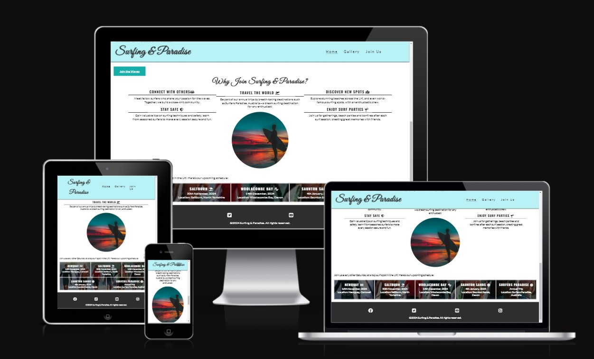
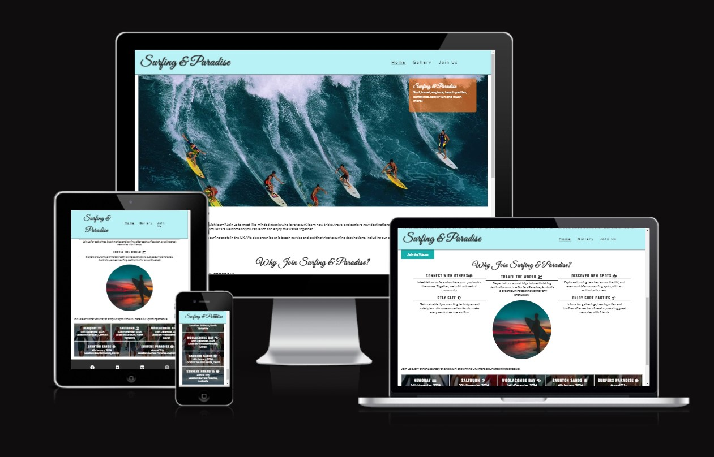
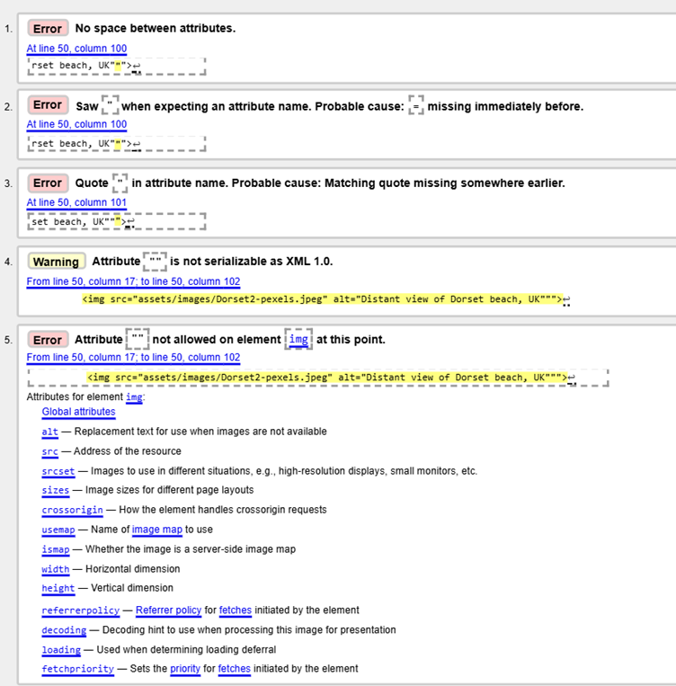
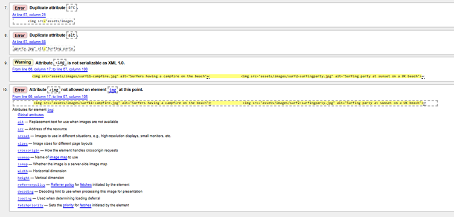

# **Surfing & Paradise** 
Website URL: https://github.com/AllaboutDee/P1

## **Site Overview**
Welcome to **Surfing & Paradise** – a community-driven site that connects surfing enthusiasts of all levels. Whether you're a beginner, intermediate, or advanced, Surfing & Paradise offers resources and events for skill-building, community engagement, and fun experiences. Our club fosters a supportive environment where members can explore and travel together, enjoy beach culture, and make lasting friendships. 

Surfing & Paradise hosts regular events, such as beach parties, picnics, and campfires, so members can relax and unwind after a surfing session. Families are welcome, as we encourage members to bring their kids along to share this family-friendly sport. This website aims to serve as an engaging, user-friendly guide for surf lovers. Built with a responsive, mobile-first approach, its layout caters to various content areas, ensuring ease of navigation and visual appeal.

## Table of contents:
1. [**Site Overview**](#site-overview)
1. [**Planning stage**](#planning-stage)
    * [***Target Audiences***](#target-audiences)
    * [***User Stories***](#user-stories)
    * [***Site Aims***](#site-aims)
    * [***How Will This Be Achieved:***](#how-this-will-be-achieved)
    * [***Wireframes***](#wireframes)
    * [***Color Scheme***](#color-scheme)
    * [***Technology Used***](#Technology-Used)
    * [***Languages Used***](#Languages-Used)
    * [***Frameworks, Libraries & Programs Used***](#Frameworks,-Libraries-&-Programs-Used)
1. [**Current Features Common to all pages**](#current-features-common-to-all-pages)
    * [***Header Element:***](#header-element)
        * [*Title*](#title)
        * [*Logo*](#logo)
        * [*Navigation Bar*](#navigation-bar)
        * [*Design*](#Design)    
    * [**Footer**](#footer)
1. [**Future-Enhancements**](#future-enhancements)
1. [**Testing Phase**](#testing-phase)
        * [*Testing*](#Testing)
        * [*Testing User Stories from User Experience (UX) Section*](#Testing-User-Stories-from-User-Experience-(UX)-Section)        
        * [*Further Testing*](#Further-Testing)
1. [**Accessibility**](#Accessibility)
1. [**Known Bugs**](#Known-Bugs)
1. [**Deployment**](#deployment)
1. [**Credits**](#credits)
    * [**Honourable mentions**](#honorable-mentions)
    * [**General reference**](#general-reference)
    * [**Content**](#content)
    * [**Media**](#media)

## Planning Stage

In the planning stage, key elements were defined to shape the site’s structure, focusing on user experience (UX) principles, aesthetic style, and interactive features for both desktop and mobile views. Each section is designed to enhance engagement and usability.

### **Planning stage**
    In the planning stage, key elements were defined to shape the website’s structure, including user experience (UX) principles, aesthetic style, and interactive features. Each section was designed to enhance engagement and usability, focusing on both desktop and mobile views.
### **Target Audiences:**
* Surfing enthusiasts of all levels
* Families seeking activities to enjoy together
* Individuals wanting to meet like-minded adventurers
* Community-oriented travelers and beach culture fans
* People eager to explore, learn, and connect within a supportive group
* Prospective new members who want to learn, participate, or get involved in future events and activities

### **User Stories:**

* As a user, I want to navigate easily across the site to find relevant information.
* As a user I want to see upcoming events easily.
* As a user I want to easily see what the website is about.
* As a user I want to see an aesthetically pleasing website.
* As a user I want to know my information is safe and secure so that I can interact with others confidently.
* As a user, I want the site to be accessible and look visually appealing on my mobile, ipad and laptop device.
* As a user and a prospective member, I want a clear sign-up form to join.
* As a user and current member, I want up-to-date information on upcoming events and meetups.

### **Site Aims:**

* Informative: Provide users with easy access to activity or club details, schedules, and information about the club.
* Engaging: Use visual elements and a clear layout to attract and retain visitor attention.
* Community-focused: Promote connection among users through events, gallery images, and sign-up options.

### **How Will This Be Achieved:**

Each aim is reflected in the design choices, such as the use of high-quality images, event schedules, a gallery page, and a signup form. The site also has a clean layout, fast loading times, and accessibility considerations, ensuring a smooth experience.

* The **Home page** has a white background with vibrant colors and images reflecting surf and sea. The header and buttons are in blue/green tones, while reds and oranges in the cover text complement the visuals, tying it all together.
* The **Gallery section** showcases vibrant pictures of members surfing, relaxing, and partying, reinforcing the club’s close-knit, community vibe.
* The **Sign-up page** features a simple form for inquiries, membership sign-ups, and newsletter subscriptions.

### **Wireframes:**

*Add wireframe visuals here:*
Initially I drew a very basic draft of what the webpages may look like on mobile view. 

[Homepage/Gallery/Signup] ()

Once the website was complete Am I Responsive tool was used display the website on different screen sizes:
    * ![Homepage]   
    
    * ![Gallery] (assets/images/screenshots/Am_I_Responsive_Gallery.jpg)
    * ![Signup] (assets/images/screenshots/Am_I_Responsive_signup.jpg)
    

### **Color Scheme:**

I selected a vibrant color scheme inspired by the sea, with blues and greens as primary colors and touches of red, orange, and yellow reflecting a sunset sky. A white background makes these colors stand out, while the header’s `#bdf2f6` color complements the hero image. The cover text container features an orange/coral tone to contrast the hero image and tie into the theme cohesively.

## **Technology Used:**
### Languages Used

-   [HTML5](https://en.wikipedia.org/wiki/HTML5)
-   [CSS3](https://en.wikipedia.org/wiki/Cascading_Style_Sheets)

### Frameworks, Libraries & Programs Used

1. [Font Awesome:](https://fontawesome.com/)
    - Font Awesome was used on the forms on the activity page, alongside the social media icons within the footer.
1. [Git:](https://git-scm.com/)
    - Git was used for version control by utilizing the command line terminal to commit to Git and Push to GitHub.
1. [GitHub:](https://github.com/)
    - GitHub was used to store the project code after being pushed from Git.
1.  [VisualStudioCode:] (https://code.visualstudio.com/)
    1.  Visual Studio Code was used to write the project code and then pushed through to the Git Repository.
1. [Favicon.io:] (https://favicon.io/)
    - Favicon.io was used to create a favicon to display in the browser. Image of a man holding a surfboard was downloaded from pixabay. This was this uploaded to favicon.io to convert the image and create the favicon item. 
1. [Hover.css:](https://ianlunn.github.io/Hover/)
    - Hover.css was used on the navigation links
1. [Pixabay:] (https://pixabay.com/)
    - Pixabay was used source royalty-free images for the website.
1. [Pexels:](https://www.pexels.com/)
    - Pexels was used to source royalty-free images for the website.

---

## **Current Features Common to all pages**
### **Main body**
The site has a consistent layout across all pages, with shared header and footer elements for easy navigation and a unified look.

### *Header Element:*
The header is used throughout the site to hold the navigation bar and the site title.

- **Title**: A clear, stylized title for easy recognition.
- **Logo**: Styled in the 'Great Vibes' font and positioned centrally, with dark coloring against the header’s blue/green background.
- **Navigation Bar**: A responsive, mobile-first menu that adjusts for various screen sizes.
- **Design**: The basic layout of the header, footer and logo is the same across the pages.

[Header] (assets/images/header.png)

### *Footer:*
The footer contains links to social media platforms (Facebook, X-app, YouTube, Instagram), with white icons on a dark grey background for a sleek, contrasting finish.

[Footer:] (assets/images/footer.png)

## **Future-Enhancements**
????
arties, picnics, and campfires, so members can relax and unwind after a surfing session. Families are welcome, as we encourage members to bring their kids along to share this family-friendly sport. This website aims to serve as an engaging, user-friendly guide for surf lovers. Built with a responsive, mobile-first approach, its layout caters to various content areas, ensuring ease of navigation and visual appeal.

---

## **Testing Phase**

### **Testing**

The W3C Markup Validator and W3C CSS Validator Services were used to validate every page of the project to ensure there were no syntax errors in the project.

-   [**W3C Markup Validator**](https://validator.w3.org/nu/) 
    
    **Homepage:**

    Initial test for the homepage shows that there were no errors to be corrected.
    

    **Gallery Page:**

    Initial tests show various errors to be corrected.
    
    

    After fixing the errors, the final test results confirm no errors or warnings.
    
    

    **Signup Page:**

    Initial tests show various errors to be corrected.
    
    
    After fixing the errors, the final test results confirm no errors or warnings.
    

-   [**W3C CSS Validator**](https://jigsaw.w3.org/css-validator) 

    **CSS**:

    Initial tests shows there are no errors be corrected.
    
    
### Testing User Stories from User Experience (UX) Section

1. As a user, I want to navigate easily across the site to find relevant information.
    1. The navigation bar is simple and easy to use. In mobile view this becomes a burger bar with a drop down option.
2. As a user I want to see upcoming events easily.
    1. The upcoming events are clearly listed on the home page, with the location and date.
3. As a user I want to easily see what the website is about.
    1. The website is clear and logical. Information is in relevant sections and in small chunks and it is not over-crowded. 
4. As a user I want to see an aesthetically pleasing website.
    1. The website is layed out nicely into sections with stunning pictures and a vibrant colour palette is used throughout.
5. As a user I want to know my information is safe and secure so that I can interact with others confidently.
    1. Users can complete the signup form safely and securely, which allows them to submit basic information such as their name and email address along with their questions or reason for contact. They can easily sign up to the newsletter.
    2. Currently the basic details are entered and someone will respond off the back of the query. At this stage the website does not ask more personal information then that but as the website grows it will list more information and allow customers to sign up for membership on line and buy merchandise at which point more safety features would be added. 
    3. At this stage of the build, the functionality for chat, sign-in and profile pages has not been implemented. 
6. As a user, I want the site to be accessible and look visually appealing on my mobile, ipad and laptop device.
    1. The website design is responsive  from mobile to ipad to laptop in most cases. There is an slight issue where the logo and menu overlap on Samsung S8+ and Galaxy Z fold 5. Also there is an issue where the header and cover-text overlap on ipad Mini. Due to time constraints this issue has not yet been correct.  
7. As a user and a prospective member, I want a clear sign-up form to join
    1. The signup form has a very simple layout. It is easy to understand and use. It offers the option of signing up to the newsletter, leaving a comment or asking a question. You can enter your level of surfing expertise aswell. 

### Further Testing

-   The Website was tested on Google Chrome, Internet Explorer and Microsoft Edge.
-   The website was viewed on a variety of devices such as Desktop, Laptop and android phones.
-   Testing was done to ensure that all pages were linking correctly without time delays.
-   Friends and family members were asked to review the site and documentation to point out     any bugs and/or user experience issues.

### Accessibility

- **Images**: All include `alt` tags for screen readers.
- **Image Formats**: Optimized with webp and jpg for fast loading.
- **Responsive Design**: Adapts to different screen sizes.
- **Semantic Elements**: Used throughout for readability and accessibility

### ***Known Bugs***

 Logo and burger menu overlap on Galaxy S8+ and Galaxy Z Fold 5. Unable to rectify due to time constraints.
- Home page cover image partly hidden by the header on iPad Mini view. Unable to fix due to time constraints. 

Fixes are planned in the future.

---

## **Deployment**
I deployed the page on GitHub pages via the following procedure: -

1. From the project's [repository](https://github.com/AllaboutDee/P1), go to the **Settings** tab.
2. From the left-hand menu, select the **Pages** tab.
3. Under the **Source** section, select the **Main** branch from the drop-down menu and click **Save**.
4. A message will be displayed to indicate a successful deployment to GitHub pages and provide the live link.

---

## **Credits**

### **Honourable mentions**

 I would like to thanks a few of my fellow bootcampers for their support in resolving issues that I stumbled upon, listed in no particular order:

- [Jasmine Price](https://github.com/jevpr): Provided guidance on code issues.
- [Asraf](https://github.com/PATH-HIVE): Offered support with GitHub and project encouragement.

### **General reference:**

- Resources: Code Institute, YouTube, W3Schools, and Stack Overflow.
- Original site structure: Based on Code Institute's "Love Running" project.
- Readme.md layout inspired by the project Tribe by Adelle King (https://github.com/AdelleKing/Tribe/blob/main/README.md). I particularly like the thoroughness of the content.

### **Content:**
* Most of the content was written by myself, the project author.
* Icons used across the website were taken from [Font Awesome](https://fontawesome.com) 

### **Media:**
* Images used for activities were taken from [Pexels](https://www.pexels.com/) and [Pixabay] (https://www.pixabay.com)

---

